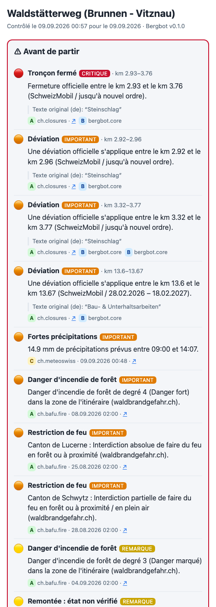

<p align="center">
  
</p>

<h1 align="center">Bergbot</h1>
<p align="center"><strong>Check everything before you go to the mountains.</strong><br>
Tell Bergbot where you want to go. It checks the weather, the trail, the hazards, the train — and hands you the route.</p>

<p align="center">
  <a href="https://github.com/suchipizza/BergBot/actions/workflows/ci.yml"></a>
  
  
  
  <a href="https://github.com/suchipizza/BergBot/stargazers"></a>
</p>

<p align="center">
  <a href="docs/screenshots/report-phone.png"></a>
  <a href="docs/screenshots/chat.png"></a>
</p>

Bergbot is an **open-source, local-first mountain-planning agent** for Switzerland (hiking first). You write one
sentence in English, French, German or Italian — or send a GPX — and Bergbot checks official Swiss data and the
live web, puts the warnings first, recommends routes, answers in ≤ 12 lines, and hands you a self-contained
mobile HTML report plus a GPX for the swisstopo app. It runs on your machine and your own AI subscription.
It is playful when it can be, serious when it must be, and it **never says a route is safe**.

## Try it

**Claude Code (plugin, one command)**
```
/plugin marketplace add suchipizza/BergBot
/plugin install bergbot
```
then `pipx install bergbot` (the plugin calls the `bergbot` CLI) and type a sentence, or `/find …`.
Works in the terminal, the desktop app and the IDE extensions — anywhere Claude Code runs on your machine.

**Claude.ai (plugin)** — Customize → Plugins → Add marketplace → `https://github.com/suchipizza/BergBot` → install
*bergbot*. It installs, but claude.ai runs skills in a sandbox that cannot reach the Swiss data sources
(GeoAdmin, SwitzerlandMobility, MeteoSwiss, transport), so Bergbot cannot check anything there. Use it only to
render an `audit.json` you produced locally. Full function: Claude Code, Telegram or the CLI.

**Telegram (your own bot, nothing hosted)**
```
pipx install "bergbot[all]"
bergbot connect telegram        # paste the token from @BotFather
```

**CLI**
```
pipx install "bergbot[all]"
export ANTHROPIC_API_KEY=…      # optional: enables web verification and free chat
bergbot chat
```

Full guides with screenshots in four languages: [docs/install](docs/install/) · [docs/connect](docs/connect/) ·
website: https://suchipizza.github.io/BergBot

## Three things to say to it

| | | |
|---|---|---|
| **EN** | Generate a hike for tomorrow with less than 500 m up in canton Glarus | Can you find a hike near Brunnen? | Check if this hike is good today *(+ GPX)* |
| **FR** | Propose une randonnée demain avec moins de 500 m de dénivelé dans le canton de Glaris | Peux-tu trouver une rando près de Brunnen ? | Vérifie si cette rando est bien aujourd'hui *(+ GPX)* |
| **DE** | Wanderung morgen mit weniger als 500 m Aufstieg im Kanton Glarus | Findest du eine Wanderung bei Brunnen? | Prüf, ob diese Wanderung heute gut ist *(+ GPX)* |
| **IT** | Proponi un'escursione domani con meno di 500 m di dislivello nel cantone di Glarona | Trovi un'escursione vicino a Brunnen? | Controlla se questa escursione va bene oggi *(+ GPX)* |

Also: *Is the Gemmi cableway running on Sunday? · Fire ban in Ticino? · send me the GPX · photos of this route · shorter · with a hut.*

## What a reply looks like

```
⚠ Before you go
🔴 Closed section km 2.96–3.81: Official closure between km 2.96 and km 3.81 (SchweizMobil / until further notice).
🟠 Diversion km 3.28–3.82: An official diversion applies between km 3.28 and km 3.82 (SchweizMobil / until further notice).
🟠 +2: Forest-fire danger, Fire restriction
🟡 not verified: Talstation Luftseilbahn Vitznau–Wissifluh
Bergbot informs. The decision is yours.
Waldstätterweg (Brunnen - Vitznau) · not graded · 14.43 km · ↑572 m ↓572 m · 4 h 41 · Brunnen (See) → Vitznau
Weather 12 Sep: clear, 15–22 °C, gusts up to 23 km/h
Transport: 07:35 Zürich HB → 08:51 Brunnen (See) · last return 23:51 from Vitznau
Report: bergbot-report-waldstaetterweg-brunnen-vitznau.html
Want the GPX or another suggestion?
```

Real, regenerable examples with reports and GPX: [examples/](examples/) — open a `report.html` on your phone.

## What it checks

Route geometry and identity (swissTLM3D network, SwitzerlandMobility routes) · distance, ascent, descent, SAC
duration · closures and diversions · hourly weather along the route, wind on exposed sections · forest-fire
danger and cantonal fire bans · wildlife quiet zones, protected areas · shooting zones and firing notices ·
livestock guardian dogs · public transport out and back, last return · lifts and huts (always *unverified*
until a page says otherwise) · water, shelters, escape points · SLF bulletin presence (never interpreted for
hiking). Every finding carries an evidence class A–E, source, timestamps and the original wording.

Sources and licences: [docs/data-licences.md](docs/data-licences.md). Coverage and health: `bergbot doctor`.

## Safety, in one paragraph

Bergbot informs; the decision is yours. Warnings always come first. Unverified stays unverified — a timetable
is not a running lift, silence is not an open hut. No route is synthesised off the official network. The
register (playful/serious) is decided by rule, not by mood, and the words "safe", "sans danger", "sicher",
"sicuro" and their friends are banned by test in every language. Emergency? Bergbot answers only: **1414 (Rega)
or 112**, share your position, stay put. Details: [docs/BERGBOT_PRD.md](docs/BERGBOT_PRD.md) §7.

## Develop

```
git clone https://github.com/suchipizza/BergBot && cd BergBot
uv sync --all-extras --dev
uv run pytest            # contracts · geometry · register · safety · i18n · snapshots · benchmark
uv run bergbot doctor
uv run bergbot audit examples/gpx-audit/route.gpx --date 2026-09-12 --out audit.json
uv run bergbot render audit.json --out report.html
```

Read [CLAUDE.md](CLAUDE.md) (rules), [docs/BERGBOT_WORK_ORDER.md](docs/BERGBOT_WORK_ORDER.md) (architecture and
milestones), [CONTRIBUTING.md](CONTRIBUTING.md) (good first canton / source / language), [ROADMAP.md](ROADMAP.md).

## Waitlist

Bergbot-hosted WhatsApp, monitoring ("tell me when the Gemmi lift reopens"), guides & huts — tell us what you'd
want: **[join the waitlist](https://tally.so/r/bergbot-waitlist)**. No promises, no spam.

---
MIT licence for the code. The mascot artwork in `brand/` is © the Bergbot founder (see `brand/mascot/README.md`).
Map data © swisstopo, © BAFU, © VBS, © ASTRA/SchweizMobil, © MeteoSchweiz, © OpenStreetMap contributors.
