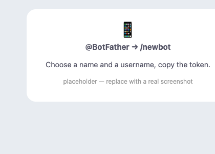
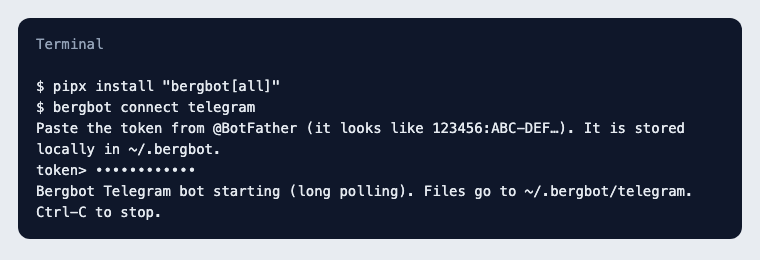
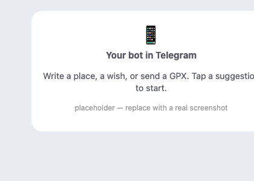

# Connect Telegram

Your own bot, running on your machine. Nothing is hosted; the token stays in ~/.bergbot.

**Step 1 — Create a bot: open @BotFather in Telegram, send /newbot, choose a name and a username, copy the token**



**Step 2 — Install and connect**
```
pipx install "bergbot[all]"
bergbot connect telegram
```


**Step 3 — Write to your bot: a place, a wish, or send a GPX. Tap a suggestion to start.**



Optional: set the avatar in @BotFather → /setuserpic with brand/mascot/dist/avatar.png

## WhatsApp

Honest note: a Bergbot-owned WhatsApp bot needs a Meta business account, a dedicated number and a public webhook, so it is a hosted beta (Phase 3). Join the waitlist to be told when it opens. Today: Telegram, or bring your own channel through your agent.
