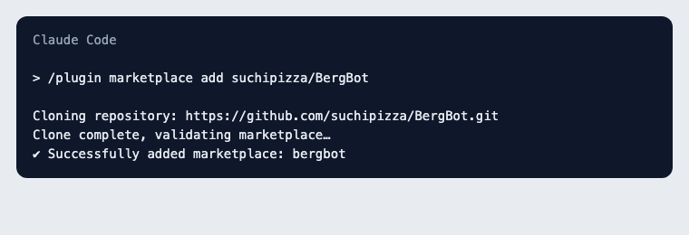
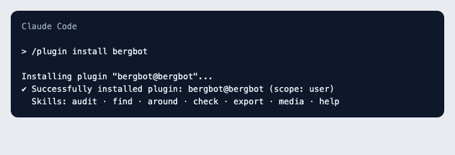
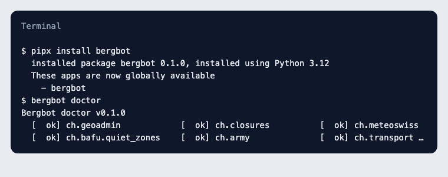
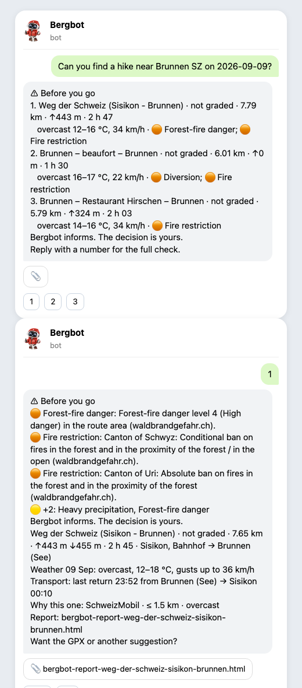

# Installer Bergbot

Une commande par surface. Chaque guide a une capture par étape ; sur le site, les commandes ont un bouton copier.

## Claude Code

**Étape 1 — Ajouter le marketplace**
```
/plugin marketplace add suchipizza/BergBot
```


**Étape 2 — Installer le plugin**
```
/plugin install bergbot
```


**Étape 3 — Installer la CLI que le plugin appelle, puis écrire une phrase ou /find …**
```
pipx install bergbot
```


## Claude.ai

S'installe via Personnaliser → Plugins → Ajouter un marketplace → `https://github.com/suchipizza/BergBot`. Vérifié le 09.09.2026 : l'installation fonctionne, mais claude.ai exécute les skills dans un bac à sable qui bloque les sources suisses (GeoAdmin, SuisseMobile, MétéoSuisse, transports). Bergbot ne peut rien contrôler et le dit (« impossible de vérifier »). Pour de vrais contrôles : Claude Code, Telegram ou la CLI ; claude.ai peut afficher un `audit.json` produit localement.

## CLI

**Étape 1 — Installer**
```
pipx install "bergbot[all]"
bergbot doctor
```
**Étape 2 — Optionnel : ta clé Anthropic active la vérification web et la conversation libre**
```
export ANTHROPIC_API_KEY=sk-ant-…
```
**Étape 3 — Discuter, ou lancer un contrôle**
```
bergbot chat
bergbot audit route.gpx --date 2026-09-12 --lang fr --out audit.json && bergbot render audit.json
```


## Ton propre canal (WhatsApp, Signal, iMessage…)

Si ton agent est déjà relié à une messagerie via un serveur MCP ou un pont, installe le plugin Claude Code et écris à ton agent depuis cette appli. Bergbot ne fournit aucun pont et ne recommande pas les ponts WhatsApp non officiels (ils violent les conditions de WhatsApp).
